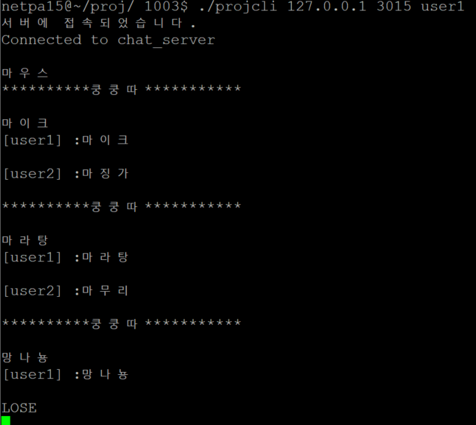

# Word-Chain-Game

## 프로젝트 소개
  * 2인용 끝말잇기 게임
  * 소켓 프로그래밍을 이용하였고, 폴링형 서버, 셀렉팅형 클라이언트로 구현하였습니다.
  * 클라이언트들이 접속하면, 서버에서 첫 제시어를 제시하고, '쿵쿵따'라는 메시지를 받은 클라이언트가 게임의 차례가 되어, 앞 단어의 끝글자로 시작하는 단어를 서버에 전송하면,
  서버는 규칙에 맞는 단어인지 판단 후, 다음 클라이언트에게 '쿵쿵따' 메시지를 보내 차례를 넘겨주는 방식으로 진행하는 게임입니다.
  자신의 차례가 아니거나 앞 단어의 끝글자로 시작하지 않는 메시지를 보내는 클라이언트는 패자가 되며 서버는 각 클라이언트에게 승패 결과를 메시지를 보내고 게임을 종료합니다.
  
## 개발언어
  * C
  
## 실행화면

